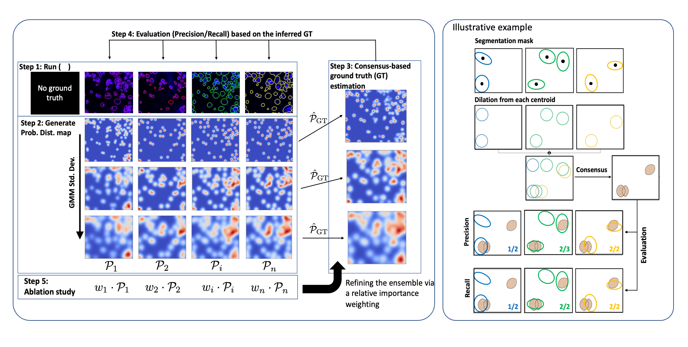

# A Framework for Comparing and Selecting from Several Segmentation Methods in Absence of Ground Truth labels

Find the bioRxiv pre-print [here](https://www.biorxiv.org/content/10.1101/2023.02.23.529809v1)!

And our poster from the HTAN Summer Meeting 2022 [here](https://github.com/lstrgar/seg-eval/files/9339751/HTAN_Abstract_TNP-TMA_analysis_final.pdf)!

## Overview

Our method derives a consensus-based ground truth segmentation by combining and ablating the results from multiple candidate segmentations. The process is probabilistic, interpreting each segmented object as a spatial probability distribution of a true segmentation. Probability maps are combined and and resulting "ground-truth" map is derived, which is then used to iteratively weight the input segmentations and improve the overall agreement across methods as represented by the ground-truth result. The below figure illustrates this process in detail:

## Jupyter Notebook
The `Segmentation Evaluation Methods Breakdown.ipynb` notebook gives a step-by-step breakdown of the process used in the accompanying paper.

